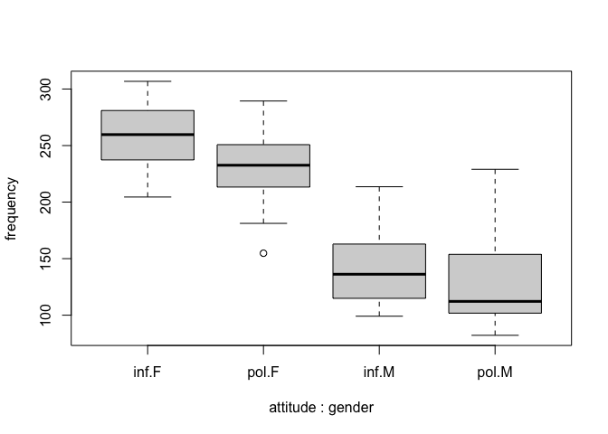

Mixed Effects Model for a Pitch Study
================
Roxy Zhang
4/6/2022

``` r
data = read.csv("data.csv")

summary(data)
```

    ##    subject             gender             scenario   attitude        
    ##  Length:84          Length:84          Min.   :1   Length:84         
    ##  Class :character   Class :character   1st Qu.:2   Class :character  
    ##  Mode  :character   Mode  :character   Median :4   Mode  :character  
    ##                                        Mean   :4                     
    ##                                        3rd Qu.:6                     
    ##                                        Max.   :7                     
    ##    frequency    
    ##  Min.   : 82.2  
    ##  1st Qu.:126.8  
    ##  Median :201.8  
    ##  Mean   :192.6  
    ##  3rd Qu.:247.4  
    ##  Max.   :306.8

``` r
boxplot(frequency ~ attitude*gender, data = data)
```

<!-- -->
